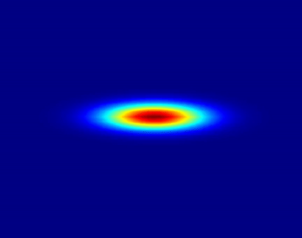

# Investigating Neural Network Architectures to Solve Parametric Partial Differential Equations

### Authors: 

Ryan Kramlich & Nicholas Cantrell

 

## Description: 

This is the repository for the final research project as part of the AMATH 563 - Inferring Structure of Complex Systems course at the University of Washington. 

## Abstract: 

In this effort we investigate the ability for Neural Networks to solve parametric fluid-governing partial differential equations (PDEs) in the 1-D and 2-D settings. The motivation for this is to overcome two bottlenecks of traditional numerical methods. The first being that a solutions accuracy is often dependent on the grid size it was solved on, and the second is the the lack of generality to new initial conditions. That is, for a new initial condition, the problem must be resolved from scratch with classical methods. We address these bottlenecks in two distinct ways each with its own objective. First, we study a multi-layered perceptron (MLP) with the goal of demonstrating the ability to solve a PDE where the solution accuracy is independent of the grid size up to a reasonable threshold. The training and evaluation of the network is done by inputting a discrete domain in space and time and evaluating the loss over the defining aspects of the PDE being the initial conditions, boundary conditions, and the differential equation. Second, we study a recurrent neural network (RNN) with the goal of learning the PDE over a uniformly distributed set of initial conditions. This enables generality in determining the solution as any initial condition from the distribution can be solved for without retraining or modifying the network.
